# 👋🏻 Hi! I'm Adrian:
🧑🏻‍💻 Software Engineer sharing about my journey and learnings in teach 
👨🏻‍🎓 Studying Computer Science at the university of UNED (Universidad Nacional de Educación a Distancia/National University of Distance Education), Spain 
🎨 Making content about Computer Science, tech, and productivity on (https://argo-platform.vercel.app) 
🌹 #learninginpublic in my [personal portfolio](https://adrigomezdev.vercel.app) 
💭 Currently learning about data analytics and cybersecurity! 

# 💻 Tech Stack:
                  

# 📊 GitHub Stats:
 
 

